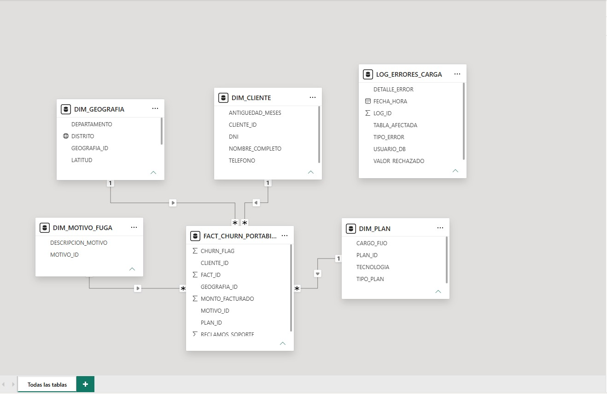
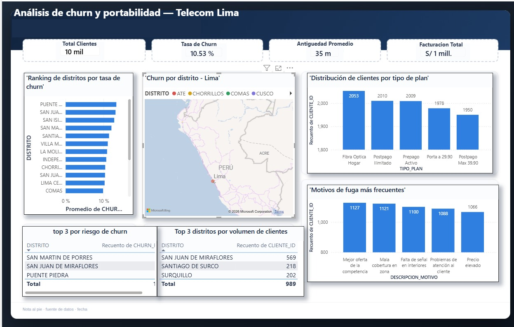
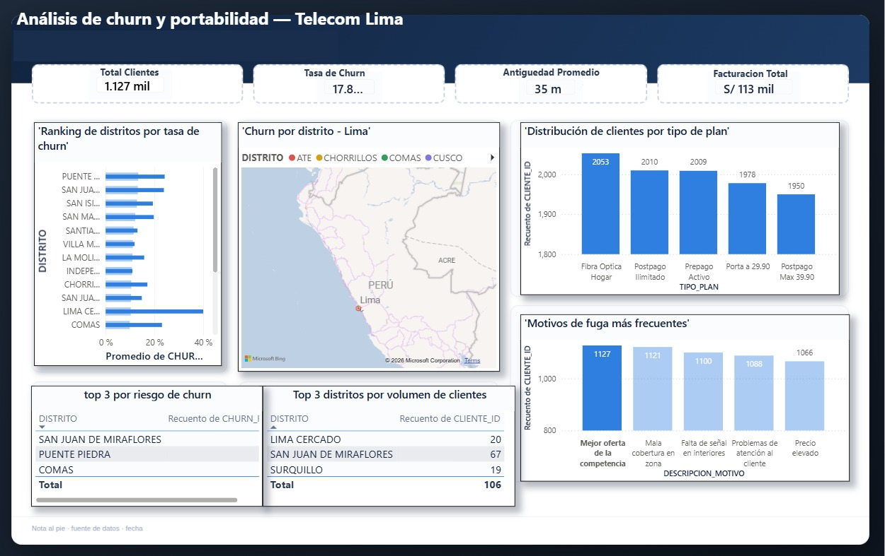
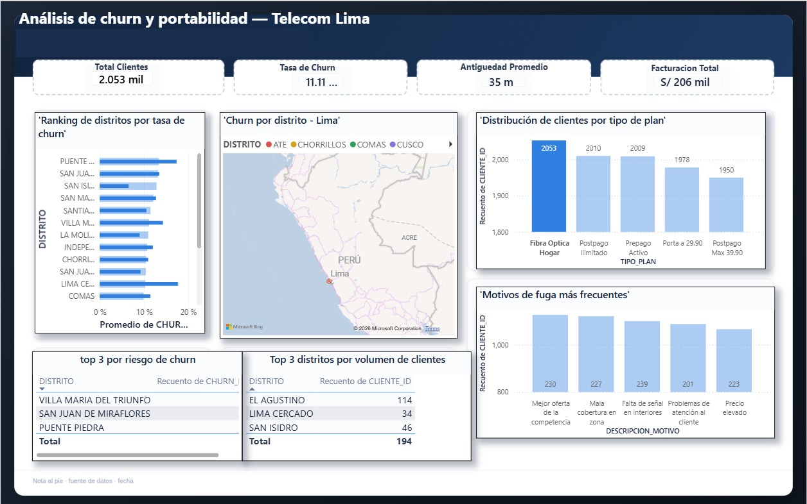
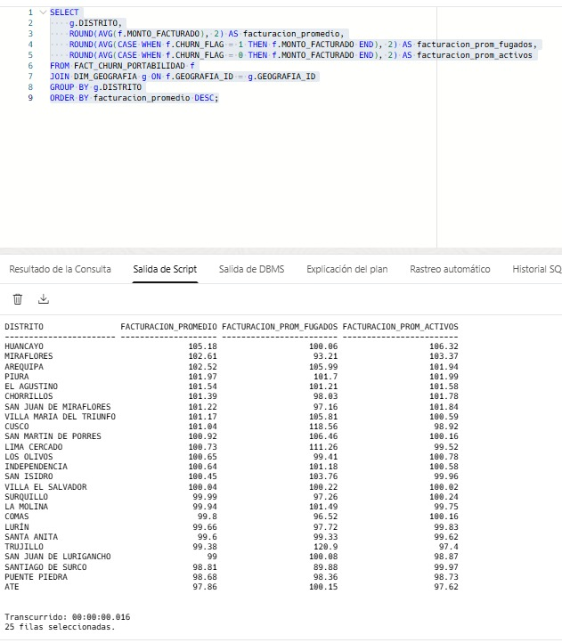
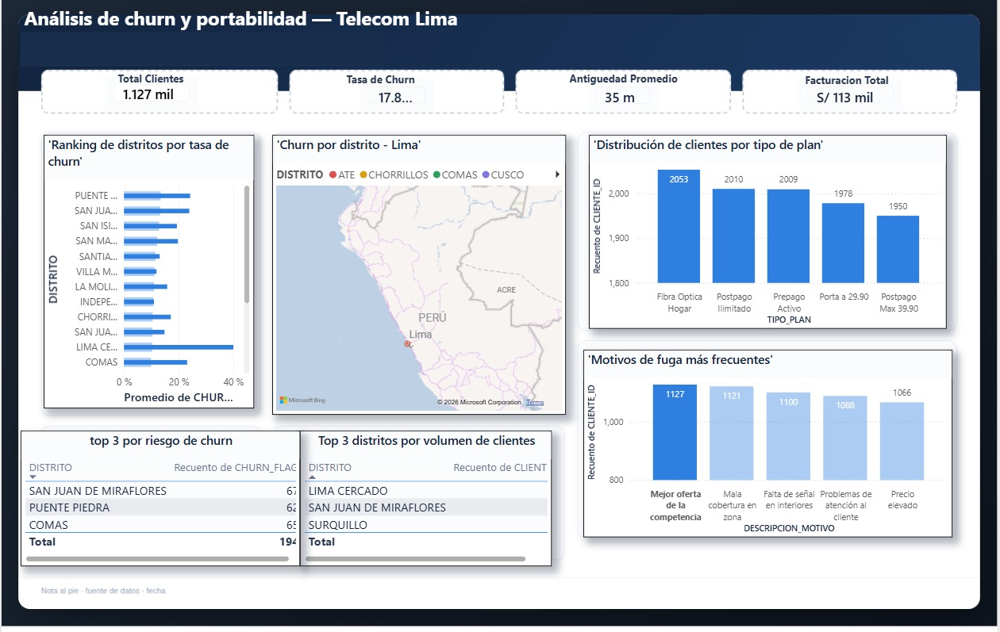
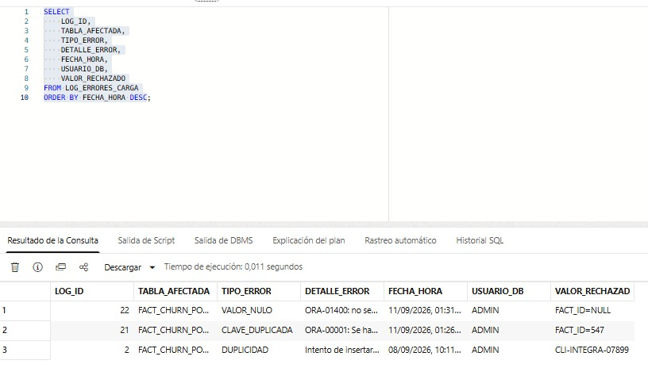

# Análisis de Churn y Portabilidad — Telecom Lima

Proyecto de análisis de datos que identifica patrones de fuga de clientes (churn) y portabilidad numérica en el sector de telecomunicaciones, usando un dataset de 10,000 clientes con enfoque geográfico en distritos de Lima, Perú.

## 🎯 Motivación

Este proyecto está orientado a roles de analista de datos en empresas de telecomunicaciones (Claro, Movistar, Entel), simulando el tipo de análisis que un equipo de retención de clientes necesitaría para tomar decisiones basadas en datos: qué distritos tienen mayor riesgo de fuga, qué factores la explican, y dónde enfocar esfuerzos comerciales.

## 🛠️ Stack técnico

- **Base de datos:** Oracle Autonomous Database (Cloud, free tier)
- **Lenguaje:** PL/SQL
- **Visualización:** Power BI Desktop
- **Dataset:** Kaggle (10,000 registros de clientes telecom)

## 🗂️ Modelo de datos

Esquema en estrella con 4 dimensiones y 1 tabla de hechos, más una tabla de control de calidad de datos:

- **DIM_CLIENTE**: datos del cliente y antigüedad (`ANTIGUEDAD_MESES`)
- **DIM_GEOGRAFIA**: departamento, provincia y distrito
- **DIM_PLAN**: tipo de plan, tecnología de red, cargo fijo
- **DIM_MOTIVO_FUGA**: motivo de la fuga del cliente
- **FACT_CHURN_PORTABILIDAD**: hechos de churn (`CHURN_FLAG`) y facturación (`MONTO_FACTURADO`)
- **LOG_ERRORES_CARGA**: registro de errores capturados durante la carga (ver sección de calidad de datos)

## 📊 Preguntas de análisis

### 1. Tasa de churn por distrito

Ranking de distritos ordenados por porcentaje de clientes que se dieron de baja, junto con KPIs generales del negocio (10 mil clientes, 10.53% de tasa de churn promedio).

### 2. Churn por distrito y comportamiento geográfico

Visualización de la distribución de churn a través de los distritos analizados.

### 3. Factores de riesgo: tecnología de red y tipo de plan

Distribución de clientes por tipo de plan, para identificar si ciertos planes o tecnologías concentran más fuga.

### 4. Valor del cliente (facturación) vs. churn

Resuelto mediante consulta SQL directa (ver `sql/03_consultas_analisis.sql`, consulta #3): compara la facturación promedio de clientes activos vs. fugados por distrito.

### 5. Permanencia promedio antes de la fuga
Resuelto mediante consulta SQL (`sql/03_consultas_analisis.sql`, consulta #4): calcula cuántos meses en promedio permanece un cliente antes de darse de baja, por distrito.

### 6. Top 3 distritos por volumen vs. top 3 por riesgo de churn

Comparación entre los distritos con mayor cantidad de clientes y los distritos con mayor riesgo de fuga — no siempre coinciden, lo cual es un hallazgo clave para priorizar esfuerzos comerciales.

## ✅ Calidad de datos

Como parte del proceso ETL, se implementó manejo de excepciones en PL/SQL para capturar errores de carga (claves duplicadas, valores nulos, etc.) sin detener el proceso completo:

Cada error queda registrado en `LOG_ERRORES_CARGA` con la tabla afectada, tipo de error, detalle, fecha, usuario y el valor rechazado — evidencia de buenas prácticas de robustez en la carga de datos.

## 💡 Hallazgos principales

- Los distritos con mayor volumen de clientes no son necesariamente los de mayor riesgo de fuga, lo que sugiere que el volumen y el riesgo requieren estrategias de retención distintas.
- "Mejor oferta de la competencia" y "mala cobertura en zona" son los motivos de fuga más frecuentes, indicando que la retención pasa tanto por precio como por calidad de red.
- Distritos con menor cobertura muestran tasas de churn más altas que el promedio general.

## 📁 Estructura del repositorio
